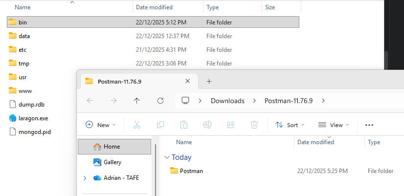
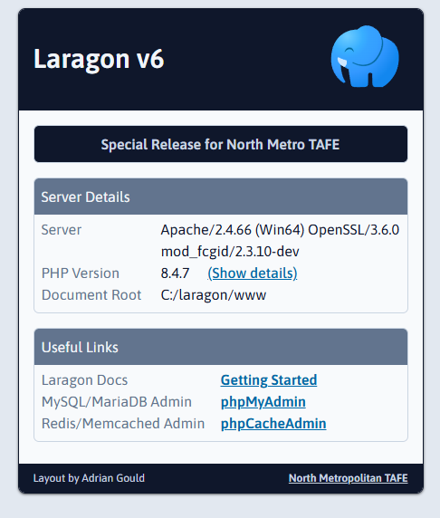

# NMTAFE-Laragon-v6

Laragon V6 for North Metro TAFE students with the current software used for studies.

Laragon is a WINDOWS ONLY server system.

## Support

We must **strongly** indicate that lecturers are under **NO obligation** to support any home or BYOD (Bring Your Own
Device) systems. If they elect to do so, it will be **outside of class time**, and **by appointment ONLY**.

It is **strongly advised** for students to use the provided computer systems when at TAFE.

## Laragon

- Executable (EXE): Original installer file - no updates
    - Double click to execute and follow prompts
- Compressed (ZIP): Base installation with some updates
    - Open in your preferred compressed file application
    - Drag and drop the Laragon folder to `C:\` or your preferred location

### Alternatives

There are alternatives to Laragon that are for individual Operating Systems, or are cross platform in some form. We have
not tested most of the options listed below.

Be aware that we use PHP 8.4 or later for all teaching, and utilise features from this version. Some of the following
may not provide that option.

| Alternative  | URL                                     | Windows | MacOS | Linux | Notes                                                         |
|--------------|-----------------------------------------|---------|-------|-------|---------------------------------------------------------------|
| Laravel Herd | https://herd.laravel.com                | YT+     | YT+   | N     | Web Server, PHP, NodeJS, etc                                  |
| dbNgin       | https://dbngin.com                      | YT+     | YT+   | N     | MariaDB, MySQL, PostgreSQL, MongoDB, etc                      |
| MAMP         |                                         | YX      | YX    | N     | Web Server, PHP, MariaDB, MySQL, etc                          |
| Vagrant      | https://developer.hashicorp.com/vagrant | YX      | YX    | YX    | Web server, PHP, MariaDB, etc; Requires a docker installation |
| Laravel Sail | https://laravel.com/docs/12.x/sail      | YX      | YX    | YX    | Web server, PHP, MariaDB etc ; Requires a docker installation |

KEY: `Y` = Available; `N` = Not Available; `T+` = Tested, OK; `T-` = Tested, Not OK; `X` = Not Tested

Our suggestions are:

- Laravel Herd and dbEngine (Windows, Mac)
- Linux - still investigating options, but Laravel Sail may be the best option.

**Alternatives are always available. Any costs are the responsibility of the individual student or private person.**

### College Installations

You cannot install the laragon zip or exe at TAFE as systems are locked down. You are only able to add updated versions
of the packages as per above instructions.

Laragon is installed, and is ready to use from the `C:\ProgramData` folder, unless in a TDM network lab such as Room
3-06, where it is installed in the root of `C:\`.

Further details from your lecturer.

### Home and TDM Installations

Unless otherwise indicated, the files when extracted are moved into the `Laragon/bin` folder.

- Exceptions to this will include, but may not be limited to, PHP and NodeJS.
- Later releases may not update all files, and feature smaller numbers of files.

Easiest way to work is to:

- Open **two** Windows File Explorers using <kbd>WIN</kbd>+<kbd>E</kbd>
- Move the first window to the LEFT using <kbd>WIN</kbd>+<kbd>LEFT ARROW</kbd>
- Move the second window to the RIGHT using <kbd>WIN</kbd>+<kbd>RIGHT ARROW</kbd>
- In the first window locate and open the downloads folder
- Right mouse click the file you downloaded, and select "Extract All".
    - This will create a folder such as `postman-1.23.4`
    - Open this folder to find a new folder which will be named similar to this or without the "version" on the end.
- In the second window locate and open the `C:\Laragon\` folder (unless otherwise indicated below)
- Locate the folder you wish to add to Laragon, and drag and drop into the bin folder, unless otherwise indicated.

You may need to exit Laragon and restart it once these steps are completed.

#### NotePad++, Postman, etc.

Note that NotePad++, Postman and some others need to replace the current folders, and they do NOT have sub folders. This
is the same for the Apache Configs files.

The VSCode installations (Release and Insiders) are both contained in the code folder. We suggest removing the current
code folder and replacing with this.

#### Windows Terminal and Bash Shell

Whilst studying at TAFE we strongly recommend that you use the Windows Terminal and add the Git Bash CLI for working at
the command line. This will become a backbone of your work for study from Certificate IV upwards.

Further details on how to set up the Terminal with the Bash CLI as default, and add some useful aliases and update the
path to suit are available from the FAQs on the [SQuASH help system](https://help.screencraft.net.au):

- [Adding Git Bash to Windows Terminal](https://help.screencraft.net.au/hc/1299211922/65/add-git-bash-to-microsoft-terminal)
- [Adding Command Line Aliases for Laravel, Git and more]( https://help.screencraft.net.au/hc/1299211922/66/add-bash-command-line-aliases-for-git)
- [Adding Laragon to the System Path](https://help.screencraft.net.au/hc/1299211922/36/adding-laragon-to-the-system-path)

You will also find more information on updating to later versions of some of the above installations on SQuASH.

### Replacement `www` Folder

We have created a small replacement for the `www` folder with a couple of extra links and presented in a way we believe focuses attention.

## Contents

| Purpose                | Website                                                                                                                 | Version                      | Download                                                                                                             | Location for files           |
|:-----------------------|:------------------------------------------------------------------------------------------------------------------------|:-----------------------------|----------------------------------------------------------------------------------------------------------------------|:-----------------------------|
| **Main System**        | [Laragon](https://laragon.org)                                                                                          | 6                            | [Laragon wamp 6 Installer](https://github.com/AdyGCode/NMTAFE-Laragon-v6/releases/download/v1.0/laragon-wamp-v6.exe) | `C:\`                        |
| **Main System**        | [Laragon](https://laragon.org)                                                                                          | 6                            | [Laragon ZIP](https://github.com/AdyGCode/NMTAFE-Laragon-v6/releases/download/v1.1/laragon.zip)                      | `C:\`                        |
|                        |                                                                                                                         |                              |                                                                                                                      |                              |
| **Configurations**     | 
                                                                                            | 
 | 
                                                                                         | 
 |
| - packages.conf        | n/a                                                                                                                     | n/a                          | [Laragon packages.conf](https://github.com/AdyGCode/NMTAFE-Laragon-v6/releases/download/v1.2/packages.conf)          | `C:\laragon\usr\`            |
| - Apache               | Apache Configs                                                                                                          | -                            | [ETC Apache](https://github.com/AdyGCode/NMTAFE-Laragon-v6/releases/download/v1.1/etc-apache2.zip)                   | `laragon/etc/`               |
|                        |                                                                                                                         |                              |                                                                                                                      |                              |
| **Database**           | 
                                                                                            | 
 | 
                                                                                         | 
 |
| - Admin                | [DBeaver](https://dbeaver.io)                                                                                           | 25.3.1                       | [DBeaver](https://github.com/AdyGCode/NMTAFE-Laragon-v6/releases/download/v1.1/dbeaver-25.3.1.zip)                   |                              |
| - Admin                | [DBGate](https://www.dbgate.io)                                                                                         | 6.8.0                        | [DBGate](https://github.com/AdyGCode/NMTAFE-Laragon-v6/releases/download/v1.1/dbgate-6.8.0.zip)                      |                              |
| - Admin                | [DB Browser for SQLite](https://sqlitebrowser.org)                                                                      | 3.13.1                       | [DB Browser](https://github.com/AdyGCode/NMTAFE-Laragon-v6/releases/download/v1.0/DB.Browser.for.SQLite.zip)         |                              |
| - Admin                | [MongoDB Compass](https://www.mongodb.com/products/tools/compass)                                                       | 1.48.2                       | [MongoDB Compass](https://github.com/AdyGCode/NMTAFE-Laragon-v6/releases/download/v1.1/MongoDBCompass-1.48.2.zip)    |                              |
| - Admin                | [phpMyAdmin](https://phpmyadmin.net)                                                                                    | 5.2                          | [PhpMyAdmin](https://github.com/AdyGCode/NMTAFE-Laragon-v6/releases/download/v1.1/phpMyAdmin-5.2.zip)                | `laragon/etc/apps`           |
|                        |                                                                                                                         |                              |                                                                                                                      |                              |
| **Editors & IDEs**     | 
                                                                                            | 
 | 
                                                                                         | 
 |
| - Debugging            | [Laradumps](https://laradumps.dev)                                                                                      | 4.10.1                       | [Laradumps](https://github.com/AdyGCode/NMTAFE-Laragon-v6/releases/download/v1.1/laradumps-4.10.zip)                 |                              |
| - MQTT                 | [MQTTX](https://mqttx.app)                                                                                              | 1.12.1                       | [MQTTX](https://github.com/AdyGCode/NMTAFE-Laragon-v6/releases/download/v1.1/MQTTX-1.21.1.zip)                       |                              |
| - Code                 | [NotePad++](https://notepad-plus-plus.org)                                                                              | 8.8.9                        | [Notepad++](https://github.com/AdyGCode/NMTAFE-Laragon-v6/releases/download/v1.1/notepad-pp-8.8.9.zip)               |                              |
| - API                  | [Postman](https://www.postman.com)                                                                                      | 11.76.9                      | [Postman](https://github.com/AdyGCode/NMTAFE-Laragon-v6/releases/download/v1.1/Postman-11.76.9.zip)                  |                              |
| - Code                 | [VS Code: Blue](https://code.visualstudio.com)                                                                          | 1.107.0                      | [VS Code Release & Insiders](https://github.com/AdyGCode/NMTAFE-Laragon-v6/releases/download/v1.1/VSCode-1.0.x.zip)  |                              |
| - Code                 | [VS Code: Green/Insiders](https://code.visualstudio.com/insiders)                                                       | 1.108.0                      | [VS Code Release & Insiders](https://github.com/AdyGCode/NMTAFE-Laragon-v6/releases/download/v1.1/VSCode-1.0.x.zip)  |                              |
|                        |                                                                                                                         |                              |                                                                                                                      |                              |
| **Languages**          | 
                                                                                            | 
 | 
                                                                                         | 
 |
| - Go                   | [Go](https://go.dev)                                                                                                    | 1.25.5                       | [Go](https://github.com/AdyGCode/NMTAFE-Laragon-v6/releases/download/v1.1/go-1.25.5.zip)                             |                              |
| - JS Runtime           | [Deno](https://deno.com)                                                                                                | 1.42.1                       | [Deno](https://github.com/AdyGCode/NMTAFE-Laragon-v6/releases/download/v1.1/deno-2.6.3.zip)                          | `laragon/bin/nodejs`         |
| - JS Runtime           | [NodeJS](https://nodejs.org)                                                                                            | 22.21.1                      | [NodeJS 22](https://github.com/AdyGCode/NMTAFE-Laragon-v6/releases/download/v1.1/node-v22.21.1.zip)                  | `laragon/bin/nodejs`         |
| - JS Runtime           | [NodeJS](https://nodejs.org)                                                                                            | 24.12.0                      | [NodeJS 24](https://github.com/AdyGCode/NMTAFE-Laragon-v6/releases/download/v1.1/node-v24.12.0.zip)                  | `laragon/bin/nodejs`         |
| - PHP                  | [PHP](https://php.net)                                                                                                  | 8.4.9 NTS Win32              | [PHP 8.4](https://github.com/AdyGCode/NMTAFE-Laragon-v6/releases/download/v1.0/php-8.4.9-nts-Win32-vs17-x64.zip)     | `laragon/bin/php`            |
| - PHP                  | [PHP](https://php.net)                                                                                                  | 8.5.1 NTS Win32              | [PHP 8.5](https://github.com/AdyGCode/NMTAFE-Laragon-v6/releases/download/v1.1/php-8.5.1-nts-Win32-vs17-x64.zip)     | `laragon/bin/php`            |
| - Python               | [Python](https://www.python.org)                                                                                        | 3.10                         | [Python](https://github.com/AdyGCode/NMTAFE-Laragon-v6/releases/download/v1.1/python-3.10.zip)                       | `laragon/bin/Python`         |
| - Python               | [Python](https://www.python.org)                                                                                        | 3.13                         | [Python](https://github.com/AdyGCode/NMTAFE-Laragon-v6/releases/download/v1.1/python-3.13.zip)                       | `laragon/bin/Python`         |
| - Python               | [Python](https://www.python.org)                                                                                        | 3.14                         | [Python](https://github.com/AdyGCode/NMTAFE-Laragon-v6/releases/download/v1.1/Python314.zip)                         | `laragon/bin/Python`         |
|                        |                                                                                                                         |                              |                                                                                                                      |                              |
| **Server**             | 
                                                                                            | 
 | 
                                                                                         | 
 |
| - Web                  | [Apache HTTPD](https://httpd.apache.org)   [Apache Lounge - Windows](https://www.apachelounge.com/download/)         | 2.4.66                       | [Apache HTTPD](https://github.com/AdyGCode/NMTAFE-Laragon-v6/releases/download/v1.1/apache.zip)                      |                              |
| - Databases / SQL      | [MariaDB](https://mariadb.com)                                                                                          | 11.4.3                       | [MariaDB](https://github.com/AdyGCode/NMTAFE-Laragon-v6/releases/download/v1.1/mariadb-12.1.2-winx64.zip)            |                              |
| - Mail                 | [Mailpit](https://mailpit.axllent.org)                                                                                  | 1.20.5                       | [Mailpit](https://github.com/AdyGCode/NMTAFE-Laragon-v6/releases/download/v1.1/MailPit-1.28.0.zip)                   |                              |
| - Search               | [Meilisearch](https://www.meilisearch.com/)                                                                             | 1.21.0                       | [Meilisearch](https://github.com/AdyGCode/NMTAFE-Laragon-v6/releases/download/v1.1/meilisearch.zip)                  |                              |
| - Databases / NoSQL    | [Memcached](https://memcached.org/)                                                                                     | 1.6.8                        | [Memcached](https://github.com/AdyGCode/NMTAFE-Laragon-v6/releases/download/v1.1/memcached.zip)                      |                              |
| - Databases / NoSQL    | [MongoDB](https://www.mongodb.com)   [Community Ed](https://www.mongodb.com/products/self-managed/community-edition) | 8.0.8                        | [MongoDB](https://github.com/AdyGCode/NMTAFE-Laragon-v6/releases/download/v1.1/mongodb-8.2.3.zip)                    |                              |
| - MQTT                 | [Mosquitto](https://mosquitto.org/)                                                                                     | 2.0.22                       | [Mosquitto](https://github.com/AdyGCode/NMTAFE-Laragon-v6/releases/download/v1.1/mosquitto-2.0.22.zip)               |                              |
| - Databases / SQL      | [MySQL](https://mysql.com)                                                                                              | 8.0.30                       | [MySQL](https://github.com/AdyGCode/NMTAFE-Laragon-v6/releases/download/v1.1/mysql-9.4.0-winx64.zip)                 |                              |
| - Web                  | [Nginx](https://nginx.org/)                                                                                             | 1.29.4                       | [Nginx](https://github.com/AdyGCode/NMTAFE-Laragon-v6/releases/download/v1.1/nginx.zip)                              |                              |
| - Databases / API      | [Pocketbase](https://pocketbase.io)                                                                                     | 0.35.5                       | [Pocketbase](https://github.com/AdyGCode/NMTAFE-Laragon-v6/releases/download/v1.1/pocketbase-0.35.0.zip)             |                              |
| - Databases / SQL      | [PostgreSQL](https://www.postgresql.org)                                                                                | 17.0                         | [PostgreSQL](https://github.com/AdyGCode/NMTAFE-Laragon-v6/releases/download/v1.1/postgresql-18.1-2.zip)             |                              |
| - Databases / NoSQL    | [Redis](https://redis.io)                                                                                               | 5.0.14.1                     | [Redis](https://github.com/AdyGCode/NMTAFE-Laragon-v6/releases/download/v1.0/Redis-5.0.14.1-x64.zip)                 |                              |
| - Databases / NoSQL    | [Rethink](https://rethinkdb.com)                                                                                        | 2.4.3                        | [RethinkDB](https://github.com/AdyGCode/NMTAFE-Laragon-v6/releases/download/v1.1/rethinkdb-2.4.3.zip)                |                              |
|                        |                                                                                                                         |                              |                                                                                                                      |                              |
| **System**             | 
                                                                                            | 
 | 
                                                                                         | 
 |
| - Information          | [BGInfo](https://learn.microsoft.com/en-us/sysinternals/downloads/bginfo)                                               | 4.33                         | [BG Info](https://github.com/AdyGCode/NMTAFE-Laragon-v6/releases/download/v1.1/BGInfo-4.33.zip)                      |                              |
| - Web Root Replacement | n/a                                                                                                                     | 1.0                          | [www](https://github.com/AdyGCode/NMTAFE-Laragon-v6/releases/download/v1.1/www.zip)                                  | `laragon`                    |

## Maintainers

| Maintainers | Name           | GitHub                                    |
|-------------|----------------|-------------------------------------------|
| Primary     | Adrian Gould   | [Ady G Code](https://github.com/AdyGCode) |
| General     | Aaron Clifford | [...](https://github.com/)                |
| General     | John Robertson | [...](https://github.com/)                |
| General     | Para O'Kelly   | [...](https://github.com/)                |
| General     | Amir Khan      | [...](https://github.com/)                |
| General     | Alex Schmidt   | [...](https://github.com/)                |
| General     | ...            | [...](https://github.com/)                |
